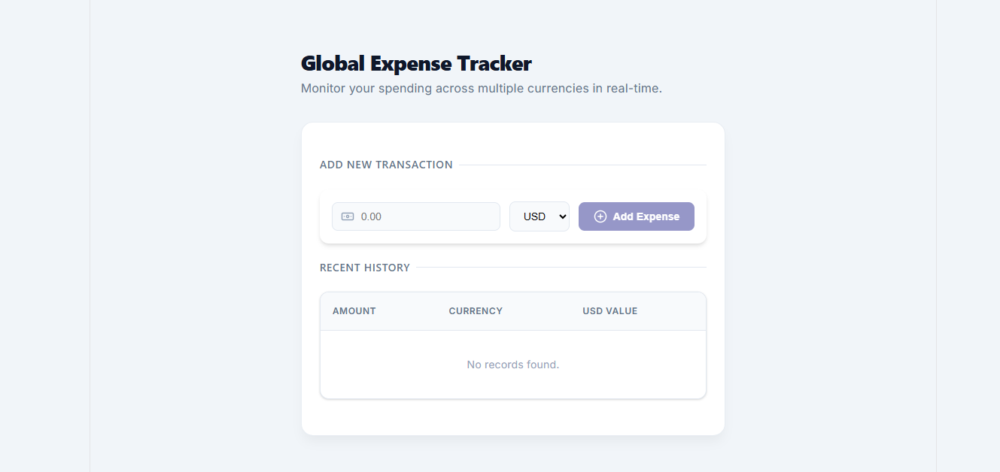
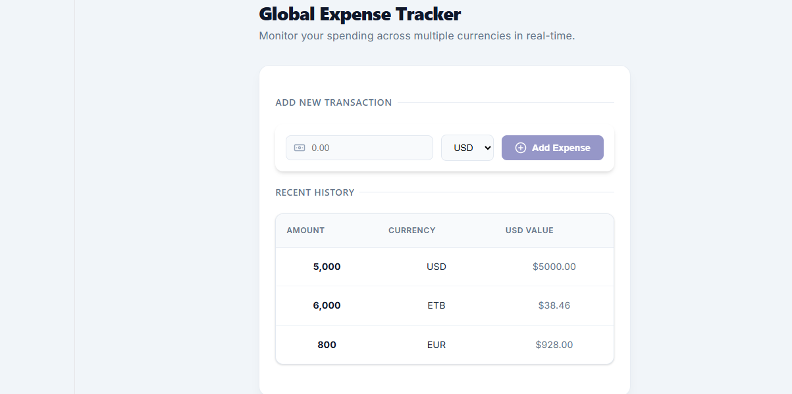

# 🌍 Global Expense Tracker

Track expenses in multiple currencies with automatic conversion to USD and a live dashboard.

---

## ✨ Features

- 💱 Add expenses in **USD, ETB, EUR**
- 🔄 Automatic currency → USD conversion
- ⚡ Live UI updates after adding expenses
- 🧾 Audit logging via middleware
- 📊 Clean, reusable React table
- 🎨 Modern UI with icons (`lucide-react`)
- 🧠 Exchange rate caching (reduces API calls)

---

## 📁 Project Structure
Global-Expense-Tracker/
│
├── backend/ # Django API
└── frontend/ # React + TypeScript


--------------------------------------------------

## 🐍 Backend Setup

```bash
cd backend

python -m venv venv

# Activate virtual environment
venv\Scripts\activate     # Windows
source venv/bin/activate  # Mac/Linux

pip install django djangorestframework django-cors-headers requests

python manage.py migrate
python manage.py runserver

--------------------------------------------------
👉 Runs on: http://127.0.0.1:8000

__________________________________________________
🔌 API Endpoints

     GET  /api/expenses/   # List all expenses
     POST /api/expenses/   # Add expense (auto converts to USD)
__________________________________________________
⚛️ Frontend Setup
     cd frontend

     npm install
     npm install lucide-react

npm run dev
________________________________________________________________________________________________________________________________________________
👉 Open: http://localhost:5173
________________________________________________________________________________________________________________________________________________
🔄 How It Works
User → React Form → API → Django Backend
     → Convert to USD → Save to DB
     → Response → UI updates instantly

_______________________________________________________________________________________________________________________________________________

🧠 Design Highlights
     **Function-Based Views (Django) → simple & **readable logic
     **Middleware → logs every conversion
     **Caching → avoids repeated API calls
     **Typed React Components → safer frontend     
________________________________________________________________________________________________________________________________________________

🚀 Run the App  
      1.Start backend
      2.Start frontend
      3.Add an expense → see instant update 
________________________________________________________________________________________________________________________________________________

🌐 System Flow Diagram
+----------------------+
|        User          |
|   (Enter Expense)    |
+----------+-----------+
           |
           v
+----------------------+
|    ExpenseForm       |
|   (React Component)  |
+----------+-----------+
           |
           v
+----------------------+
|      API Call        |
|  POST /api/expenses  |
+----------+-----------+
           |
           v
+----------------------+
|   Django Backend     |
|  FBV + Middleware    |
| (Logging + Caching)  |
+----------+-----------+
           |
           v
+----------------------+
|      SQLite DB       |
| Store + USD Value    |
+----------+-----------+
           |
           v
+----------------------+
|  Response to Client  |
|  (Saved Expense)     |
+----------+-----------+
           |
           v
+----------------------+
|   React Table UI     |
|  Live Update View    |
+----------------------+
_______________________________________________________________________________________________________________________
## 📸 Screenshots

### Dashboard


### Add Expense
